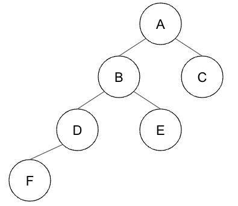

# Binary Trees

## Review

### Sequence Data Structures

|               | Access      | Insert first | Insert last | Insert at pos |
| ------------- | ----------- | ------------ | ----------- | ------------- |
| Array         | $O(1)$      | $O(n)$       | $O(n)$      | $O(n)$        |
| Linked List   | $O(n)$      | $O(1)$       | $O(n)$      | $O(n)$        |
| Dynamic Array | $O(1)$      | $O(n)$       | $O(1)$      | $O(n)$        |
| **Goal**      | $O(\log n)$ | $O(\log n)$  | $O(\log n)$ | $O(\log n)$   |

### Set Data Structures

|              | Search       | Insert       | Find min     | Find prev    |
| ------------ | ------------ | ------------ | ------------ | ------------ |
| Array        | $O(n)$       | $O(n)$       | $O(n)$       | $O(n)$       |
| Sorted Array | $O(\log n)$  | $O(n)$       | $O(1)$       | $O(\log n)$  |
| Map          | $O(1)$       | $O(1)$       | $O(n)$       | $O(n)$       |
| **Goal**     | $O(\log n)$  | $O(\log n)$  | $O(\log n)$  | $O(\log n)$  |

## Binary Tree

* Binary tree is a pointer-based data structure with three pointers per node
* Node representation:

  ```golang
  type node struct {
    value  T
    left   *node
    right  *node
    parent *node // optional
  }
  ```
### Example



| node   | A     | B     | C     | D     | E     | F     |
| ------ | ----- | ----- | ----- | ----- | ----- | ----- |
| value  | A     | B     | C     | D     | E     | F     |
| left   | *B*   | *D*   |       | *F*   |       |       |
| right  | *C*   | *E*   |       |       |       |       |
| parent |       | *A*   | *A*   | *B*   | *B*   | *D*   |

### Terminology

* The **root** of a tree has no parent
* A **leaf** of a tree has no children
* Define **depth** of node `<X>` to be length of path from `<X>` to the root
* Define **height** of node `<X>` to be max depth of any node in the subtree rooted at `<X>`

### Exercises

Implement functions in `exercises/binary_tree.go`. Provide tests for each function.

#### Examples

```
        _______3______
       /              \
    ___5__          ___1__
   /      \        /      \
   6      _2_     0        8
         /   \
         7    4
```

For the above tree,

* `nodeCount` must return `9`.
* `height` must return `3`,
* `inorderTraversal` visits nodes in the following order `6 5 7 2 4 3 0 1 8`.

The inverted tree to the above tree is

```
        _______3______
       /              \
    ___1__          ___5__
   /      \        /      \
   8      0      _2_       6
                /   \
               4     7
```